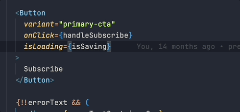
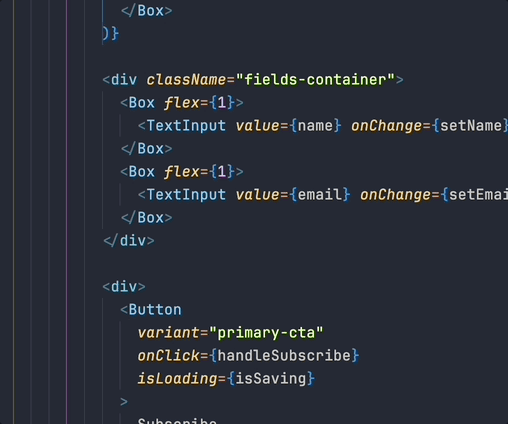
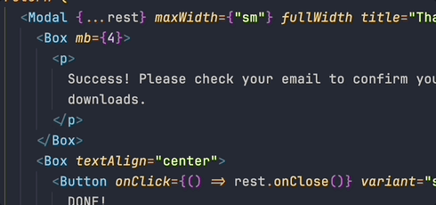
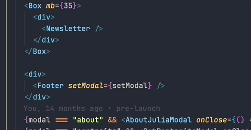

# JSX Jockey

JSX Jockey is a VSCode extension that speeds up your React development by letting you add and remove matching JSX tags in a single operation.

It creates new pairs of tags right where you need them, and deletes them in pairs while still preserving their children.

## Features

### Wrap With New Tags

-   Wrap a JSX element with new tags.

-   Highlight sibling elements to wrap them all in a new tags.

-   Highlight text to wrap it with new tags.

### Remove JSX Element

-   Remove an element but preserve its contents.

## Release Notes

### 1.0.0

Initial release.
